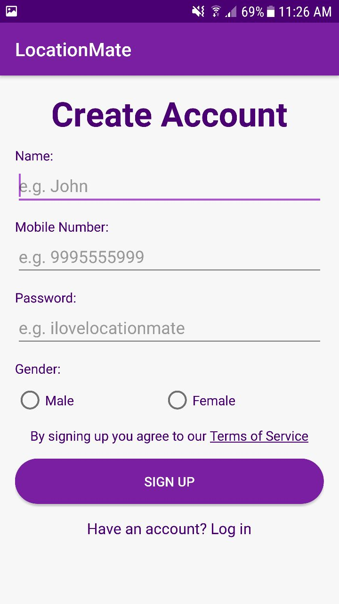
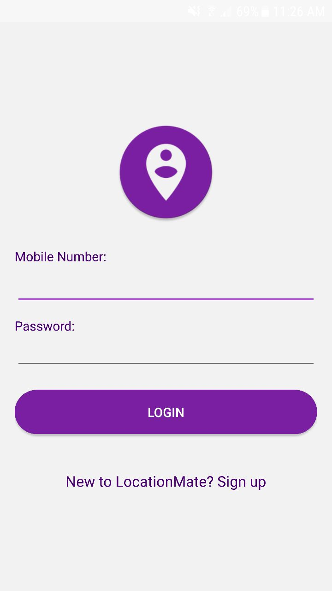
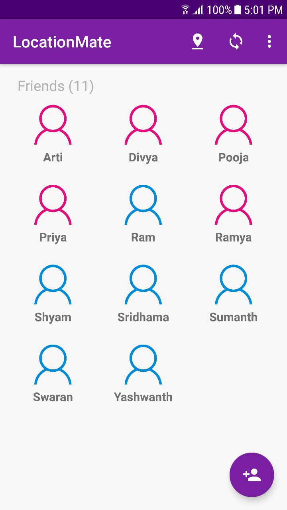
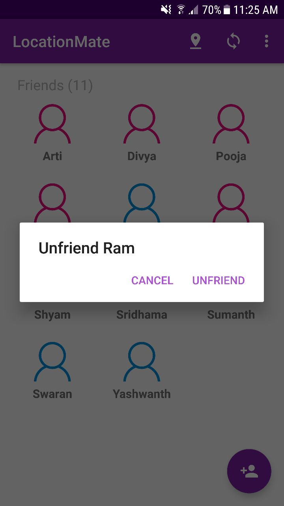
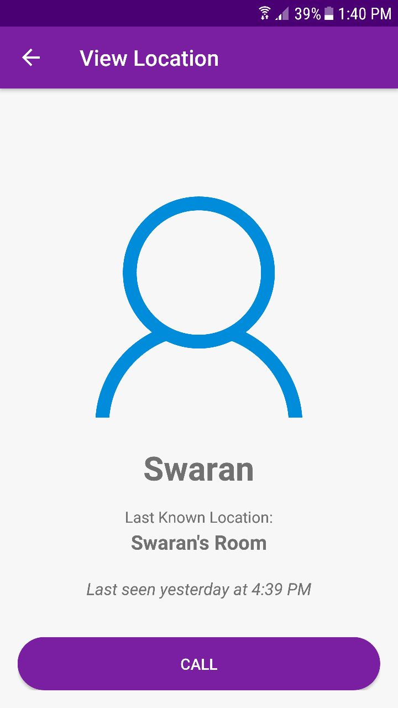
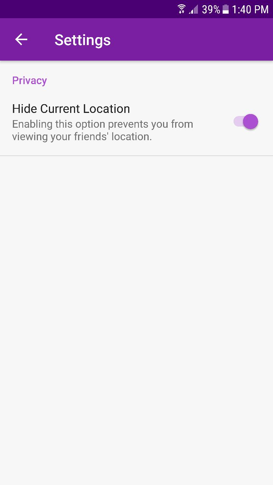
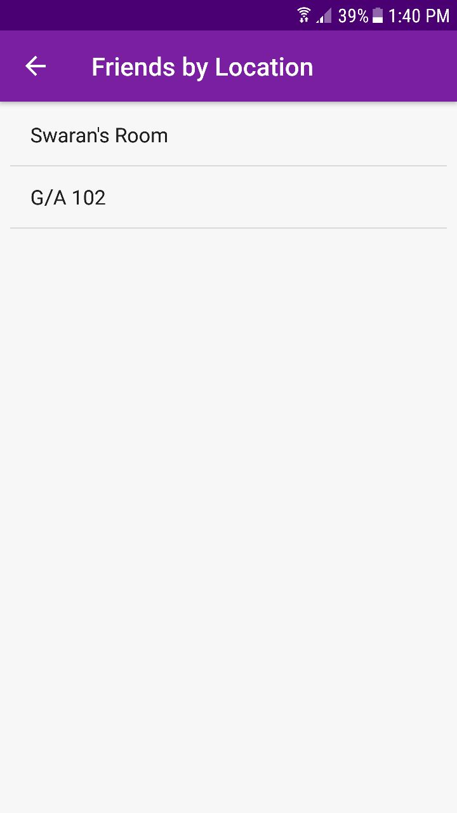
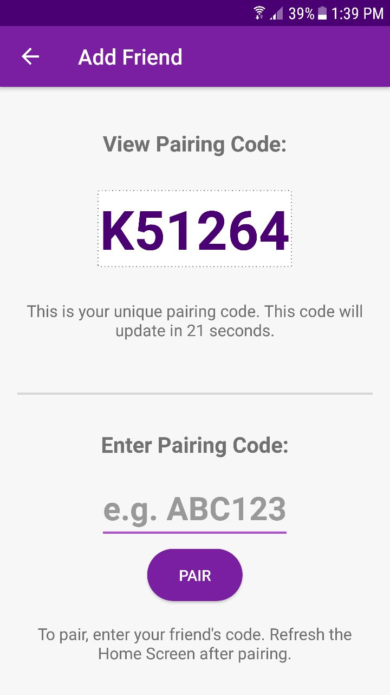

# LocationMate

### A hassle-free way to find your friends!

LocationMate, as the name suggests, is an Android app to help find the location of your friend within a large campus with WiFi availability (our university in our case). Our app makes it easier to find out the location of a person around the university without much hassle i.e., without involving phone calls, text messaging, etc. We mapped the BSSIDs of numerous wireless access points located throughout our university to unique locations. The app works by finding the BSSID of the nearest access point and retrieving the respective location from our BSSID-location database.

## Features

* More accurate than GPS
* No internet connection required
* Add friends securely
* View and call friends by location
* Doesn't drain your battery
* Hide your location
* Simple UI

## Screenshots

## Built with

* Java
* PHP
* Android Studio
